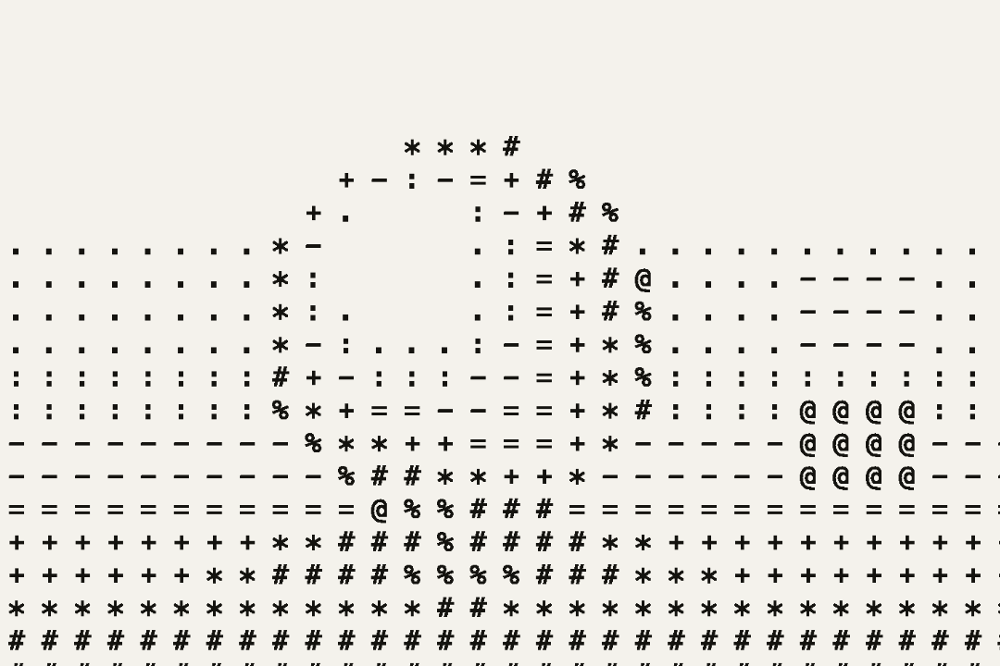
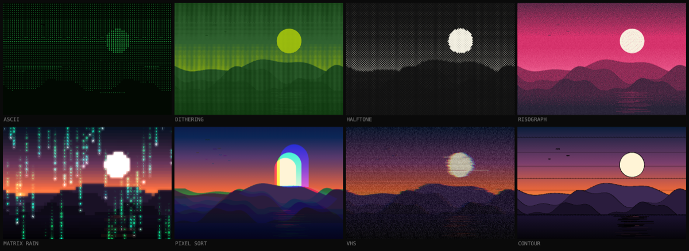

<div align="center">

# filtr

**Real-time retro effects studio.** Turn images, video, GIFs and your webcam into
ASCII art, dithered prints, halftones and CRT/retro screen effects — rendered live
with WebGL2, entirely in the browser.

### [→ filtr.org.uk](https://filtr.org.uk)



</div>

## Effects

Fifteen effects, each with its own parameters, composable with seven
post-processing stacks — bloom, grain, chromatic aberration, CRT curve,
scanlines, vignette and phosphor.



- **Render styles:** ASCII (custom charsets), dithering (Floyd–Steinberg,
  Atkinson, Jarvis-Judice-Ninke, Stucki, Burkes, Sierra, Bayer 2/4/8/16,
  clustered-dot, blue-noise, interleaved gradient), halftone
  (circle/square/diamond/line), dots (square & hex grids), edge detection
  (Sobel, Prewitt, Laplacian, crosshatch, contour), pixel sort, matrix rain,
  wave lines, Voronoi mosaic, blockify, threshold, noise field, VHS.
- **Inputs:** image · video · animated GIF · webcam.
- **Colour:** brightness/contrast/saturation/hue/gamma/posterize/invert, plus
  retro palettes (Amber, Phosphor, GameBoy, Risograph, Cyberpunk, Sepia,
  Newsprint, custom…).
- **Presets:** fourteen built-ins, plus save / import / export of your own, and
  a share link that encodes a whole look into a URL.
- **Export:** PNG, JPG, animated GIF, video, SVG vector, and ASCII text.
- **PWA:** installable and works offline.

## Privacy

Your images and video never leave your device — every effect runs on your own GPU,
and there is no upload step anywhere in the app. The site counts anonymous page
views (Vercel Web Analytics: cookieless, no cross-site tracking, no personal data,
nothing derived from your files). That is the only network request filtr makes
after the page has loaded.

## Develop

```bash
npm install
npm run dev        # http://localhost:5173
npm run build      # type-check + production build to dist/
npm run preview    # serve the production build
```

### Visual test harness

The WebGL output is verified with headless Chromium (SwiftShader):

```bash
npm run dev &                       # in one shell
node scripts/shoot.mjs              # screenshots every style + preset
node scripts/export-test.mjs        # verifies PNG / GIF / SVG / text exports
node scripts/gen-icons.mjs          # regenerate app icons + social preview
node scripts/gen-readme-media.mjs   # regenerate the contact sheet above
```

## Architecture

The renderer is a dependency-free, imperative GLSL pass pipeline (`src/engine`)
that never touches React: `prep → effect → post → composite`, with a ping-pong
framebuffer pair chaining the passes and programs compiled lazily on first use.
UI state lives in a Zustand store the render loop reads imperatively, so moving a
slider never re-renders the component tree.

Error-diffusion dithering runs on the CPU for still images (`src/engine/cpuDither.ts`)
because the algorithm is inherently sequential, and falls back to an ordered GPU
pass for video and webcam.

Vite · React · TypeScript · Tailwind CSS · WebGL2 (GLSL ES 3.00) · Zustand · vite-plugin-pwa.

## Deploy

Static SPA — any static host works. Configs are included for **Vercel**
(`vercel.json`) and **Netlify** (`netlify.toml`). Build with `npm run build`,
serve `dist/`.

## License

MIT — original work; not affiliated with any other effects tool.

MIT covers the code. It grants no rights to the **filtr** name or logo — fork it
freely, but please ship it under your own name.
